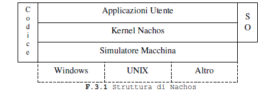
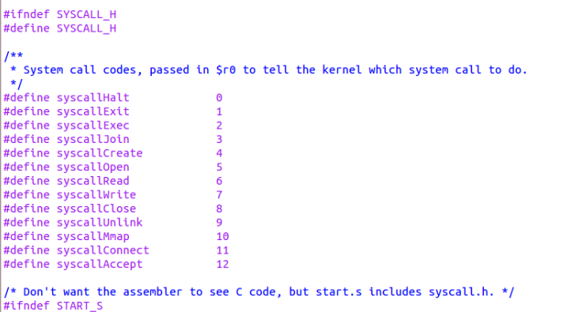

# Progetto PDS 2022/2023

### Obiettivi
Effettuare un' analisi comparativa tra due o più sistemi operativi open-source progettati per sistemi embedded e computer ad uso generale.

## Parte 1 - Differenze tra sistemi operativi: Os161 e Nachos

La prima fase del nostro progetto è stata soprattutto esplorativa: il nostro obiettivo era quello di identificare uno o più sistemi operativi che, rispettassero i prerequisiti richesti e che potessero essere un buon oggetto di studio per una comparazione con OS161. Ne abbiamo individuati diversi ed ecco alcuni esempi:
- **FreeRTOS**: FreeRTOS è un sistema operativo in tempo reale open-source progettato per sistemi embedded. È noto per la sua leggerezza e il basso impatto sulle risorse. È ampiamente utilizzato in dispositivi come microcontrollori e microprocessori.
- **TinyOS**: TinyOS è un sistema operativo open-source orientato ai sensori, progettato per reti di sensori wireless e dispositivi a bassa potenza. È ottimizzato per applicazioni IoT e dispone di un'architettura modulare.
- **µC/OS-II** e **µC/OS-III**: µC/OS-II e µC/OS-III sono sistemi operativi in tempo reale progettati per sistemi embedded. µC/OS-II è una versione più leggera, mentre µC/OS-III offre una maggiore scalabilità e funzionalità avanzate.
- **Nachos**: Una sistema operativo che esattamente come OS161 nasce con scopi didattici ma che è sostanzialmente completo in tute le sue parti, con una compilazione difficile e che, nonostante csò, offre spazio e manovra per implementare altro.

Dopo averli analizzati a grandi linee e dopo averne scartati tanti altri, per diversi motivi, abbiamo optato per iniziare un lavoro comparativo con il sistema operativo: **Nachos** per cercare di identificare e trattare le possibili differenze proprio con OS161, con il quale condividono il fine ultimo: la didattica. 

### Nachos - Not Another Completely Heuristic Operating System 

Il sistema operativo Nachos è eseguito come processo utente UNIX e, come tale,
gode degli stessi diritti di un normale software. Per semplificare e rendere
agevole l’uso di Nachos (che è pur sempre un sistema operativo
per uso didattico) questo è stato progettato con l’idea di non rendere
necessario, per la sua esecuzione, il possesso di una specifica macchina: Nachos
è, infatti, scritto sulla base di un simulatore macchina che funge da
intermediario astratto tra il kernel e l’hardware sottostante. 
Questa politica favorisce inoltre la portabilià verso altre architetture di questa
infrastruttura didattica. Il codice sorgente di kernel e simulatore sono linkati
assieme per costruire l’eseguibile finale.



Il kernel di Nachos, in caso di attività di I/O, si interfaccia con il
simulatore macchina attraverso opportune funzioni; il simulatore provvede
all’emulazione di timer, disco rigido, console, set di istruzioni MIPS R2/3000 e
network. La simulazione è riproducibile in quanto, tutti gli eventi e gli
errori, sono tempificati sulla base di numeri pseudo-casuali generati da un seme
(seed) che è noto ad ogni esecuzione di Nachos.
#### Vantaggi e Svantaggi
- **Vantaggi**:

-> Nachos è stato sviluppato all'Università di Berkeley, quindi potrebbe avere alcune somiglianze concettuali con OS161.

-> La struttura modulare di Nachos potrebbe facilitare l'implementazione e l'analisi delle diverse caratteristiche da valutare.

-> È progettato per supportare sistemi operativi embedded e generali.
- **Svantaggi**:

-> Più complesso rispetto a OS161.

-> Codice scritto per lo più in C++, o in Java in alcune versioni
(come quella da noi utilizzata)

#### **Struttura**
Il codice sorgente di Nachos è suddiviso in direttori, ognuno dei quali contiene
il sorgente di una componente logica del sistema operativo. Ogni cartella
contiene il suo Makefile2 che è in grado di generare un eseguibile di prova del
sottosistema logico in esame (per esempio eseguire l’utility make nella cartella
threads genera una versione di Nachos per testare le funzionalità relative ai
threads).
- Nachos/code – contiene l’albero dei sorgenti del sistema operativo
- Nachos/code/bin – sorgente delle utilità necessarie a generare eseguibili
utilizzabili dal sistema Nachos (coff2noff)
- Nachos/code/filesys – sorgente relativo al file system
- Nachos/code/lib – sorgente di alcune funzionalità di libreria utilizzate
dal kernel (liste e funzioni per il debug)
- Nachos/code/machine – sorgente del simulatore macchina
- Nachos/code/network – sorgente relativo alle funzionalità di networking
- Nachos/code/test – sorgente delle applicazioni utente scritte per essere
eseguite da Nachos
- Nachos/code/threads – contiene il sorgente relativo alla gestione dei
threads
- Nachos/code/userprog – sorgente relativo alle funzionalità per il
caricamento ed esecuzione delle applicazioni utente


---- 
### Bibliografia
NACHOS
https://www.irisa.fr/alf/downloads/puaut/Systeme/NachosEnglish.pdf


## Analisi Sistemi operativi
### 1. System Call

**Cosa sono le System Call?**
Le System Call o 'chiamate di sistema' sono un meccaniscmo fondamentale nei sistemi operativi che consentono ai _proessi utenti_ di interagire con il _Kernel_ cosentendo ai programmi utente di richiedere servizi e risorse offerti dal sistema operativo.

(1.0) Il _Kernel_ è il *core* di un sistema operativo che gestisce le risorse hardware e fornisce i servizi a basso livello ai processi utente. Quest'ultimi sono i programmi in esecuzione sul sitema che operano in modalità utente ( una modalità con restrizioni di accesso alle risorse hw e al codice kernel, per garantire isolmento e sicurezza). Il Kernel  quindi mette a disposizione queste **System Call**, per consentire ai processi utente di eseguire operazioni di cui, altrimenti, non avrebbero i privilegi. Queste operazioni sono varie ed includono: accesso a dispositivi, gestione file, creazione processi, gestione memoria e altro ancora. 
Le System Call offorno un'interfaccia standardizzata per accedere ai servizi del Kernel. 
Molto spesso, quelle che per noi utenti sono semplici funzioni traducibili con un: read(), write() ecc.. si trasformano in una serie di istruzioni Assembly e, di conseguenza, di System Call.
Per esempio la funzione read(): 

- Il processo chiama la funzione read() passando: descrittore del file, buffer in cui i dati saranno memorizzati e numero massimo di byte da leggere.
- L'istruzione read() viene tradotta in un'istruzione di assembly specifica per la piattaforma. Questa istruzione assembler corrisponde a una chiamata di sistema.
- L'istruzione di assembly specifica per la chiamata di sistema viene eseguita dal processo utente
- L'istruzione di assembly di chiamata di sistema fa sì che il processo passi dalla modalità utente alla modalità kernel
- All'interno del kernel, esiste una tabella delle chiamate di sistema (**system call table**) che associa un numero identificativo univoco a ciascuna chiamata di sistema supportata
- Il kernel utilizza il numero di sistema chiamato per individuare la corrispondente routine di gestione read(). Questa routine esegue le operazioni necessarie per leggere i dati dal file e copiarli nel buffer del processo utente.
-Dopo aver completato l'operazione read(), il kernel ritorna il controllo al processo utente. Il risultato della chiamata di sistema, che include il numero di byte letti, viene restituito al processo utente.
Il processo utente riprende l'esecuzione dalla posizione successiva all'istruzione read().

Le chiamate di sistema sono spesso confuse con gli interrupt, ma hanno scopi e meccanismi diversi. Gli interrupt sono segnali hw genereati da sistemi esterni che interrompono il normale flusso  di esecuzione del processo in corso. Al contratrio, una system call è un meccanismo attraverso il quale un processo utente richiede esplicitamente un servizio dal Kernel, passando il controllo a quest'ultimo solo quando necessario.
Questo passaggio da livello utente a livello kernel è molto delicato, poichè  il codice del kernel deve essere eseguito in modalità privilegiata. Inoltre, viene utilizzato uno stack diverso, noto come "stack di kernel".


Sia OS/161 che NACHOS sono sistemi operativi educativi utilizzati per scopi didattici nel campo dei sistemi operativi. Entrambi offrono un ambiente per esplorare i concetti fondamentali dei sistemi operativi, ma ci sono differenze significative nel modo in cui gestiscono le system call (chiamate di sistema). Di seguito, confronto come funzionano le system call in OS/161 e NACHOS:
#### OS/161:
- **Gestione delle System Call**: In OS/161, le system call vengono gestite in modalità kernel. Quando un'applicazione utente esegue una system call, il controllo passa al kernel.
- **Switch di Modalità**: Quando avviene una system call, OS/161 passa dalla modalità utente alla modalità kernel, nota anche come "modalità privilegiata". Questo è reso possibile grazie alle istruzioni specifiche delle architetture dei processori moderni.
- **Interrupt e Traps**: Per passare dalla modalità utente alla modalità kernel, OS/161 fa uso di interruzioni o trappole. L'applicazione utente genera un'interruzione o trappola attraverso un'istruzione di assembly, e il controllo passa al gestore di interruzioni del kernel.
- **Gestione del Contesto**: Quando il kernel gestisce una system call, salva il contesto dell'applicazione utente (registri, puntatori di stack, ecc.), esegue il codice della system call e poi ripristina il contesto dell'applicazione utente prima di restituire il controllo all'applicazione.
- **Supporto**: Supporta una gamma più ampia di system call che riflettono meglio le funzionalità di un sistema operativo completo. Include operazioni di gestione dei processi, gestione dei file, comunicazione tra processi, sincronizzazione e altro.

#### NACHOS:
- **Gestione delle System Call**: NACHOS gestisce le system call in modo simile a OS/161. Le chiamate di sistema vengono gestite dal kernel di NACHOS.
- **Switch di Modalità**: Anche NACHOS effettua un passaggio dalla modalità utente alla modalità kernel quando viene eseguita una system call.
- **Interrupt e Traps**: Come OS/161, NACHOS fa uso di interruzioni o trappole per passare dalla modalità utente alla modalità kernel durante l'esecuzione di una system call.
- **Gestione del Contesto**: NACHOS segue un approccio simile a OS/161 nel salvare e ripristinare il contesto durante la transizione tra modalità utente e modalità kernel.
- **Supporto**: 
ha una selezione più limitata di system call focalizzate principalmente su funzionalità di base come lettura/scrittura da file, creazione di thread e fork di processi. Non affronta necessariamente concetti più avanzati come la comunicazione tra processi (ma può essere implementata...)


In OS/161, le informazioni sulle chiamate di sistema sono organizzate all'interno di tabelle e strutture dati specifiche.
Al contrario, Nachos non implementa strutture simili. Nel codice sorgente delle system call di Nachos, è possibile trovare le implementazioni delle varie system call.


### Gestione delle Chiamate di Sistema:
In OS/161, le **system call** sono gestite in questo modo:

- **Interruzioni (Trappole)**: Quando un'applicazione utente richiede un servizio del kernel attraverso una chiamata di sistema, il controllo passa dalla modalità utente alla modalità kernel. Questo passaggio avviene attraverso una trappola o un'interruzione. 
- **Interrupt Handler del Kernel**: Una volta che l'interruzione o la trappola viene generata, il controllo passa all'interrupt handler del kernel: una porzione di codice del kernel che gestisce gli eventi generati dalle interruzioni e dalle trappole.
- **Gestione delle Chiamate di Sistema**: Il kernel di OS/161 ha una tabella delle chiamate di sistema (_system call table_) che associa i numeri delle chiamate di sistema alle funzioni del kernel corrispondenti. Ad esempio, il numero 0 potrebbe essere associato a una chiamata di sistema per terminare un processo, il numero 1 per scrivere su un file, il numero 2 per leggere da un file, e così via.

Esempio di definizione di una tabella delle chiamate di sistema in OS/161:

```c
// Definizione della tabella delle chiamate di sistema in OS/161
typedef int (*syscall_function_t)(void);
syscall_function_t syscall_table[SYSCALL_COUNT];
```

- **Esecuzione delle Chiamate di Sistema**: Una volta individuata la chiamata di sistema richiesta e associata alla sua funzione corrispondente, il kernel esegue il codice della funzione di chiamata di sistema.
- **Restituzione dei Risultati**: Dopo l'esecuzione della chiamata di sistema, il controllo ritorna all'applicazione utente, e il risultato della chiamata di sistema (ad esempio, il valore restituito da una funzione di lettura/scrittura) può essere restituito all'applicazione.
- **Ripristino del Contesto**: Durante il passaggio dalla modalità utente alla modalità kernel, e viceversa, il kernel salva e ripristina il contesto del processo corrente, compresi i registri, lo stack e altre informazioni importanti. Questo è necessario per garantire che l'esecuzione possa riprendere correttamente dopo una chiamata di sistema.

In sostanza, OS/161 gestisce le chiamate di sistema attraverso il passaggio controllato tra le modalità utente e kernel, utilizzando interrupt handler specifici per instradare le chiamate al codice appropriato nel kernel.

Ogni numero di chiamata di sistema è associato a una funzione specifica nel kernel. Ecco un esempio semplificato di come potrebbe apparire la definizione e l'inizializzazione della tabella delle chiamate di sistema in OS/161:
##### Os161
```c
// Definizione delle chiamate di sistema in OS/161
#define SYS_HALT 0
#define SYS_READ 2
// ... altre chiamate di sistema ...
// Inizializzazione della tabella delle chiamate di sistema
syscall_table[SYS_HALT] = sys_halt;
syscall_table[SYS_READ] = sys_read;
// ... inizializzazione di altre chiamate di sistema ...
```
Una volta che una chiamata di sistema è stata richiesta dall'applicazione utente, il kernel esegue la funzione associata all'interno della tabella delle chiamate di sistema.
Esempio di implementazione semplificata di sys_read in OS/161:
```c
int sys_read(int filehandle, char *buf, size_t size) {
    // Implementazione della lettura dal filehandle nel buffer
    // Restituzione del numero di byte letti o di un valore di errore }
```
Le _system call_ sono scritte in linguaggio assembly o in linguaggio C, a seconda dell'implementazione del sistema operativo e dell'architettura del processore. 
Ecco alcuni esempi di system call comuni e importanti:
- **fork()**: Crea un nuovo processo identico (clonato) dal processo chiamante. Questa system call è fondamentale per la creazione di processi in sistemi a processo multipli.
- **exec()**: Sostituisce l'immagine del processo corrente con un nuovo programma specificato. Questa system call è utilizzata per avviare nuovi programmi all'interno di un processo.
- **read()** e **write()**: Consentono di leggere dati da un file o di scrivere dati in un file. Queste system call sono utilizzate per operazioni di I/O di base su file.
- **open()** e **close()**: Aprono e chiudono file. L'apertura di un file restituisce un descrittore di file che può essere utilizzato per altre operazioni di I/O.
- **malloc()** e **free()**: Queste system call sono usate per allocare e liberare la memoria dinamica. Sono fondamentali per la gestione della memoria nei programmi.
- **exit()**: Termina il processo corrente e restituisce un valore di uscita al padre. Questa system call è utilizzata per terminare un programma e restituire un risultato al chiamante.
- **wait()**: Sospende il processo chiamante fino a quando uno dei suoi processi figlio termina. Viene utilizzata per sincronizzare l'esecuzione dei processi.
- **ioctl()**: Fornisce un'interfaccia generica per controllare vari aspetti dei dispositivi di I/O, come terminale, stampante, ecc.
- **chdir()** e **getcwd()**: Cambiano la directory corrente o restituiscono il percorso della directory corrente.
- **time()**: Restituisce l'ora di sistema corrente.

##### Nachos
Le **system call** (chiamate di sistema) in Nachos sono implementate attraverso l'interfaccia tra il codice dell'applicazione e il kernel del sistema operativo. 

Ogni funzione nella classe NachosSyscall corrisponde a una chiamata di sistema specifica. L'implementazione di queste funzioni dipende dalla specifica azione richiesta dalla chiamata di sistema.

                -

 In NACHOS le system call sono implementate direttamente all'interno delle librerie del sistema operativo e dei file di codice sorgente, senza l'uso di una tabella dedicata. L'interfaccia delle chiamate di sistema è fornita in syscall.h, nella directory userlib. Il codice corrispondente, scritto nel linguaggio assembly MIPS, è riportato nel file sys.s, nella directory userlib. In generale le chiamate di sistema restituiscono NO ERROR in caso di successo o -1 in caso di errore. Un codice di errore per l'ultima chiamata di sistema invocata viene mantenuto dal kernel Nachos (vedi file kernel/msgerror.*), e una chiamata di sistema (PError) visualizza il messaggio di errore corrispondente.
 
 
                -

All'interno di NACHOS, il controllo delle chiamate di sistema avviene tramite la l' ExceptionHandler.
 
All'avvio del processo corrente, viene inizializzato in uno stato di deafult. 
```java
// machine->Processor.java
/** Set the exception handler, called whenever a user exception occurs.
 * @param exceptionHandler the Kernel exception handler
 **/
public void setExceptionHandler(Runnable exceptionHandler){
    this.exceptionHandler = exceptionHandler;
}

/** Get the exception handler, set by the last call to <tt> setExceptionHandler()</tt>
 * @return the exception handler
**/
public Runnable getExceptionHandler(){
    return exceptionHandler;
}
```

Quando viene generata un'interruzione o una trappola, l'ExceptionHandler esamina il tipo di chiamata di sistema richiesta e inoltra l'esecuzione alla funzione corrispondente nella tabella delle chiamate di sistema.

Esempio semplificato di gestione delle chiamate di sistema in ExceptionHandler:
```java
// userprog -> UserKernel.java
public voidexceptionHandler() {
    Lib.assertTrue(KThread.currentThread() instanceof UThread); //controllo di assert che verifica se il thread corrente è un'istanza di UThread. 

    UserProcess process = ((UThread) KThread.currentThread()).process();//estre il processo utente associato al thread corrente
    int cause = Machine.processor().readRegister(Processor.regCause);//si legge il registro della CPU per ottenere il motivo dell'eccezione corrente
    process.handleException(cause); //gestione dell'eccezione
}
``` c
// userprog -> UserKernel.java

/**
 * @param syscall the syscall number
 * @param a0 the first syscall argument
 * @param a1 the second syscall argument
 * @param a2 the third syscall argument
 * @param a3 the fourth syscall argument
 * @return the value to be returned to the user
 **/ 
public int handleSyscall(int syscall, int a0, int a1, int a2, int a3){
    switch (syscall) {
        case syscallHalt:
            return handleHalt();
        default:
            Lib.debug(dbgProcess, "Unknown syscall " + syscall);
            Lib.assertNotReached("Unknown system call!");
    }
    return 0;
}

/**
 * Handel a user exception. Called by UserKernel.exceptionHandler(). The cause argument identifies which exception occurred
 * 
 * @param cause the user exception that occurred
 **/
public void handleException(int cause){
    Processor processor = Machine.processor();
    switch (cause) {
        case Processor.exceptionSyscall;
        int result = handleSyscall(processor.readRegister(Processor.regV0),
        readRegister(Processor.regA0),readRegister(Processor.regA1),readRegister(Processor.regA2),readRegister(Processor.regA3));
        processor.writeRegister(Processor.regV0, result);
        processo.advancePC();
        break;

    default:
        Lib.debug(dbgProcess, "Unexpected exception: "+Processor.exceptionNames[cause]);
        Lib.assertNotReached("Unexpected exception");
    }
}

```
Le *system call* in Nachos sono scritte usando una combinazione di linguaggio Assembly MIPS e C++.


 Di seguito alcuni esempi di chiamate di sistema importanti in Nachos:

1. **Halt**: Una chiamata di sistema che ferma il sistema operativo.
```c
// Interfaccia in C++
void Halt();

// Implementazione in Assembly MIPS
Halt:
    # Carica il codice dell'interrupt per la chiamata di sistema Halt
    li $v0, 10
    syscall
    j $ra
```

2. **Exit**: Una chiamata di sistema per terminare un processo.
```c
// Interfaccia in C++
void Exit(int status);

// Implementazione in Assembly MIPS
Exit:
    # Carica il codice dell'interrupt per la chiamata di sistema Exit
    li $v0, 17
    syscall
    j $ra
```

3. **Create**: Crea un nuovo file.
```c
// Interfaccia in C++
OpenFileId Create(char *name);

// Implementazione in Assembly MIPS
Create:
    # Carica il codice dell'interrupt per la chiamata di sistema Create
    li $v0, 8
    syscall
    j $ra
```

4. **Open**: Apre un file esistente.
```c
// Interfaccia in C++
OpenFileId Open(char *name);

// Implementazione in Assembly MIPS
Open:
    # Carica il codice dell'interrupt per la chiamata di sistema Open
    li $v0, 9
    syscall
    j $ra
```

5. **Read**: Legge dati da un file aperto.
```c
// Interfaccia in C++
int Read(char *buffer, int size, OpenFileId id);

// Implementazione in Assembly MIPS
Read:
    # Carica il codice dell'interrupt per la chiamata di sistema Read
    li $v0, 14
    syscall
    j $ra
```

6. **Write**: Scrive dati in un file aperto.
```c
// Interfaccia in C++
void Write(char *buffer, int size, OpenFileId id);

// Implementazione in Assembly MIPS
Write:
    # Carica il codice dell'interrupt per la chiamata di sistema Write
    li $v0, 15
    syscall
    j $ra
```
