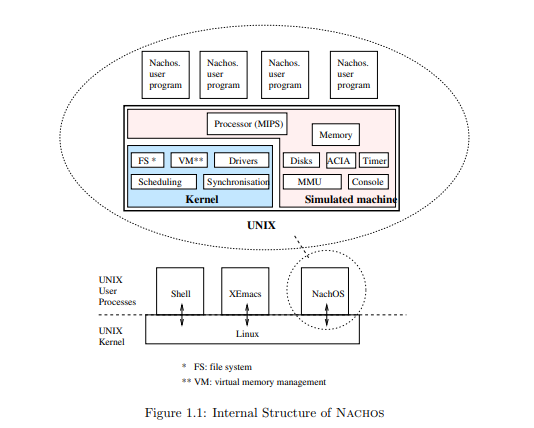
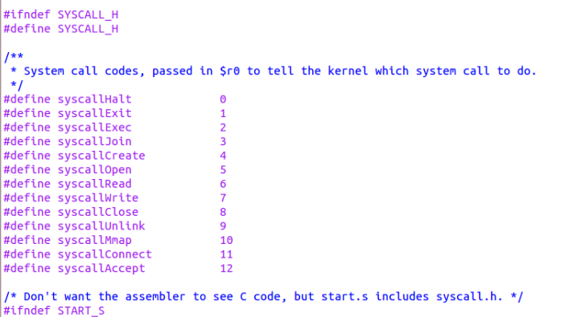

# Progetto PDS 2022/2023

### Obiettivi
Effettuare un' analisi comparativa tra due o più sistemi operativi open-source progettati per sistemi embedded e computer ad uso generale.

## Parte 1 - Differenze tra sistemi operativi: Os161 e Nachos

La prima fase del nostro progetto è stata soprattutto esplorativa: il nostro obiettivo era quello di identificare uno o più sistemi operativi che, rispettassero i prerequisiti richesti e che potessero essere un buon oggetto di studio per una comparazione con OS161. Ne abbiamo individuati diversi ed ecco alcuni esempi:
- **FreeRTOS**: FreeRTOS è un sistema operativo in tempo reale open-source progettato per sistemi embedded. È noto per la sua leggerezza e il basso impatto sulle risorse. È ampiamente utilizzato in dispositivi come microcontrollori e microprocessori.
- **TinyOS**: TinyOS è un sistema operativo open-source orientato ai sensori, progettato per reti di sensori wireless e dispositivi a bassa potenza. È ottimizzato per applicazioni IoT e dispone di un'architettura modulare.
- **µC/OS-II** e **µC/OS-III**: µC/OS-II e µC/OS-III sono sistemi operativi in tempo reale progettati per sistemi embedded. µC/OS-II è una versione più leggera, mentre µC/OS-III offre una maggiore scalabilità e funzionalità avanzate.
- **Nachos**: Una sistema operativo che esattamente come OS161 nasce con scopi didattici ma che è sostanzialmente completo in tute le sue parti, con una compilazione difficile e che, nonostante csò, offre spazio e manovra per implementare altro.

Dopo averli analizzati a grandi linee e dopo averne scartati tanti altri, per diversi motivi, abbiamo optato per iniziare un lavoro comparativo con il sistema operativo: **Nachos** per cercare di identificare e trattare le possibili differenze con OS161, con il quale condividono il fine ultimo: la didattica. 

### Nachos - Not Another Completely Heuristic Operating System 

Il sistema operativo Nachos è eseguito come processo utente UNIX e, come tale,
gode degli stessi diritti di un normale software. Per semplificare e rendere
agevole l’uso di Nachos (che è pur sempre un sistema operativo
per uso didattico) questo è stato progettato con l’idea di non rendere
necessario, per la sua esecuzione, il possesso di una specifica macchina: Nachos
è, infatti, scritto sulla base di un simulatore macchina che funge da
intermediario astratto tra il kernel e l’hardware sottostante. 
Questa politica favorisce inoltre la portabilià verso altre architetture di questa
infrastruttura didattica. Il codice sorgente di kernel e simulatore sono linkati
assieme per costruire l’eseguibile finale.



Nachos è strutturato in categorie di funzionalità:
- Il kernel contiene le caratteristiche vitali di Nachos: processi leggeri (thread), sincronizzazione
tra thread, programmazione, spazi di indirizzo;
- I driver di dispositivo forniscono l'interfaccia per accedere ai dispositivi hardware (simulati)
(disco, console) ,
- Gestione della memoria virtuale (dettagliata in seguito);
- Gestione dei file

La combinazione dell'hardware simulato, del kernel Nachos e i programmi utente Nachos vengono complessivamente eseguiti in un unico processo Unix, come illustrato nelle immagini. 
Questo approccio ha un duplice vantaggio:

1)  Lo sviluppo del kernel è semplificato perché l'hardware simulato, sebbene abbastanza realistico, è volutamente molto semplice.
2) Il debug del codice del kernel Nachos è facilitato, perché un errore nel file non blocca la macchina e gli strumenti di debug standard (ad esempio gdb) possono essere utilizzati.

Il kernel di Nachos, in caso di attività di I/O, si interfaccia con il
simulatore macchina attraverso opportune funzioni; il simulatore provvede
all’emulazione di timer, disco rigido, console, set di istruzioni MIPS R2/3000 e
network. La simulazione è riproducibile in quanto, tutti gli eventi e gli
errori, sono tempificati sulla base di numeri pseudo-casuali generati da un seme
(seed) che è noto ad ogni esecuzione di Nachos.

#### **Struttura**
Il codice sorgente di Nachos, per lo più scritto in C++, è suddiviso in direttori, ognuno dei quali contiene
il sorgente di una componente logica del sistema operativo.
- Nachos/code – contiene l’albero dei sorgenti del sistema operativo
- Nachos/code/filesys – sorgente relativo al file system
- Nachos/code/lib – sorgente di alcune funzionalità di libreria utilizzate
dal kernel (liste e funzioni per il debug)
- Nachos/code/machine – sorgente del simulatore macchina
- Nachos/code/network – sorgente relativo alle funzionalità di networking
- Nachos/code/test – sorgente delle applicazioni utente scritte per essere
eseguite da Nachos
- Nachos/code/threads – contiene il sorgente relativo alla gestione dei
threads
- Nachos/code/userprog – sorgente relativo alle funzionalità per il
caricamento ed esecuzione delle applicazioni utente

__ Modificare a seconda della versione originale di Nachos

__Modificare grammatica e punteggiatura

## Analisi
### 1. Kernel
**Cos'è il Kernel?** Il _Kernel_ rappresenta il nucleo fondamentale di un sistema operativo. È responsabile della gestione delle risorse hardware e della fornitura di servizi essenziali a livello basso per i processi utente. I processi utente sono i programmi in esecuzione sul sistema, che operano nella cosiddetta modalità utente. Questa modalità impone restrizioni di accesso alle risorse hardware e al codice del kernel al fine di garantire isolamento e sicurezza.


    Il _Kernel_  fornisce i servizi a basso livello ai processi utente. Quest'ultimi sono i programmi in esecuzione sul sistema che operano in modalità utente ( una modalità con restrizioni di accesso alle risorse hw e al codice kernel, per garantire isolmento e sicurezza).Quindi mette a disposizione le **System Call**, per consentire ai processi utente di eseguire operazioni di cui, altrimenti, non avrebbero i privilegi. Queste operazioni sono varie ed includono: accesso a dispositivi, gestione file, creazione processi, gestione memoria e altro ancora. 

**Funzioni Principali**
Il Kernel svolge diverse funzioni cruciali per il funzionamento del sistema operativo:

Gestione delle Risorse: Il Kernel alloca e gestisce le risorse hardware, come memoria, processori, dispositivi di I/O e spazio su disco. Coordinando l'accesso a queste risorse, il Kernel evita conflitti e ottimizza l'utilizzo delle stesse.

Abstrazione Hardware: Fornisce un'astrazione uniforme dell'hardware sottostante per i processi utente. Ciò permette ai programmi di interagire con l'hardware in modo standardizzato, indipendentemente dalla specifica configurazione del sistema.

Gestione dei Processi: Il Kernel gestisce la creazione, l'allocazione e la terminazione dei processi. Coordina anche il passaggio dei processori da un processo all'altro, garantendo l'efficienza e l'equità nell'uso delle risorse.

Gestione della Memoria: Controlla la gestione della memoria fisica e virtuale del sistema. Assegna porzioni di memoria ai processi, proteggendo i processi tra loro e garantendo l'integrità del sistema.

Gestione degli Interruttori: Il Kernel gestisce gli interrupt, che sono segnali generati da hardware o eventi esterni che richiedono l'attenzione immediata del sistema. Questi possono includere segnali di dispositivo di I/O completato o errori hardware.

#### Nachos
Il **kernel** di Nachos gestisce un insieme di processi leggeri (thread) che vengono eseguiti contemporaneamente sul file Processore MIPS (simulato) e condividono lo stesso _process address space_. 


-----
Chiamiamo processo la combinazione di uno spazio di indirizzi e del set
di thread che lo condividono. Ogni processo è parallelo agli altri.
La politica di pianificazione implementata è puramente FIFO (First In, First Out) senza alcun concetto di
priorità del thread e nessuna condivisione del tempo. Gli strumenti di sincronizzazione forniti contano i semafori,
variabili di condizione e blocchi di mutua esclusione.

-----


NachOS è progettato per essere un sistema **monolitico semplificato**, il che significa che tutto il kernel opera nello stesso spazio di indirizzi e condivide risorse direttamente. Questo rende la gestione delle system call relativamente più semplice, ma potrebbe portare a problemi di sicurezza e stabilità in un ambiente di produzione

#### Os161
Os161 è basato su un'architettura a microkernel, il che significa che il kernel è **modulare**(diverse funzionalità sono suddivise in moduli separati. Questi moduli possono essere sviluppati, testati e sostituiti in modo indipendente) e divide le funzionalità del sistema operativo in componenti distinti. Questi componenti possono comunicare tra loro attraverso meccanismi di messaggistica.


---
**MicroKernel** E' una filosofia di progettazione dei sistemi operativi che mira a _minimizzare la complessità del kernel_ spostando gran parte delle funzionalità nel livello degli spazi utente (user space). Un microkernel implementa solo le funzionalità di base come la gestione dei processi e la comunicazione tra di essi, mentre altre funzionalità come la gestione della memoria e dei driver dei dispositivi vengono implementate come servizi esterni. Questo approccio rende il sistema più modulare, resiliente e facilmente estendibile, poiché le parti del sistema possono essere sviluppate e sostituite in modo indipendente. Il microkernel è utile perché aiuta a isolare le parti critiche del sistema, rendendo più semplice la manutenzione e l'aggiornamento, e riducendo il rischio di fallimenti critici che potrebbero colpire l'intero sistema operativo.

---

La _memoria_ nel kernel di 0s161 è solitamente suddivisa in tre parti principali:

1) Kernel Text: Questa è l'area di memoria in cui risiede il codice eseguibile del kernel. Contiene le istruzioni necessarie per eseguire le operazioni di base del sistema operativo.

2) Kernel Data: Questa area memorizza le variabili globali e i dati utilizzati dal kernel. Include strutture dati come tabelle di processo, informazioni sulla gestione della memoria e altre variabili di stato del kernel.

3) Heap e Stack Kernel: Queste aree sono utilizzate per la gestione dinamica della memoria all'interno del kernel. Lo heap viene utilizzato per l'allocazione dinamica di strutture dati, mentre lo stack gestisce le chiamate alle funzioni e le variabili locali.

---

### 2. System Call

**Cosa sono le System Call?**
Le System Call o 'chiamate di sistema' sono un meccaniscmo fondamentale nei sistemi operativi che consentono ai _proessi utenti_ di interagire con il _Kernel_ e di richiedere servizi e risorse offerti dal sistema operativo.

Le System Call offrono un'interfaccia standardizzata per accedere ai servizi del Kernel. Ciò semplifica l'uso di funzioni apparentemente semplici come read() e write(), che si traducono in istruzioni Assembly e, quindi, in System Call.

---
**ATTENZIONE**
Le chiamate di sistema sono spesso confuse con gli interrupt, ma hanno scopi e meccanismi diversi. Gli interrupt sono segnali hw genereati da sistemi esterni che interrompono il normale flusso  di esecuzione del processo in corso. Al contratrio, una system call è un meccanismo attraverso il quale un processo utente richiede esplicitamente un servizio dal Kernel, passando il controllo a quest'ultimo solo quando necessario.
Questo passaggio da livello utente a livello kernel è molto delicato, poichè  il codice del kernel deve essere eseguito in modalità privilegiata. Inoltre, viene utilizzato uno stack diverso, noto come "stack di kernel".

---


#### Os161:
- **Gestione delle System Call**: In OS/161, le system call vengono gestite in modalità kernel. Quando un'applicazione utente esegue una system call, il controllo passa al kernel.
- **Switch di Modalità**: Quando avviene una system call, OS/161 passa dalla modalità utente alla modalità kernel, nota anche come "modalità privilegiata". Questo è reso possibile grazie alle istruzioni specifiche delle architetture dei processori moderni.
- **Interrupt e Traps**: Per passare dalla modalità utente alla modalità kernel, OS/161 fa uso di interruzioni o trappole. L'applicazione utente genera un'interruzione o trappola attraverso un'istruzione di assembly, e il controllo passa al gestore di interruzioni del kernel.
- **Gestione del Contesto**: Quando il kernel gestisce una system call, salva il contesto dell'applicazione utente (registri, puntatori di stack, ecc.), esegue il codice della system call e poi ripristina il contesto dell'applicazione utente prima di restituire il controllo all'applicazione.
- **Supporto**: Supporta una gamma più ampia di system call che riflettono meglio le funzionalità di un sistema operativo completo. Include operazioni di gestione dei processi, gestione dei file, comunicazione tra processi, sincronizzazione e altro.
- **Astrazione e modularità**: OS161 promuove una maggiore astrazione e modularità rispetto a NachOS. Le system call sono implementate come chiamate remote attraverso messaggi, il che consente una maggiore separazione tra il codice utente e il codice kernel.
- **Isolamento e protezione**: Grazie alla separazione dei servizi e dei componenti nel microkernel di OS161, è più probabile che il sistema operativo offra un maggiore isolamento e protezione tra le diverse componenti. Questo è vantaggioso in termini di sicurezza e stabilità.


#### NACHOS:
- **Gestione delle System Call**: NACHOS gestisce le system call in modo simile a OS/161. Le chiamate di sistema vengono gestite dal kernel di NACHOS.
- **Switch di Modalità**: Anche NACHOS effettua un passaggio dalla modalità utente alla modalità kernel quando viene eseguita una system call.
- **Interrupt e Traps**: Come OS/161, NACHOS fa uso di interruzioni o trappole per passare dalla modalità utente alla modalità kernel durante l'esecuzione di una system call.
- **Gestione del Contesto**: NACHOS segue un approccio simile a OS/161 nel salvare e ripristinare il contesto durante la transizione tra modalità utente e modalità kernel.
- **Supporto**: ha una selezione più limitata di system call focalizzate principalmente su funzionalità di base come lettura/scrittura da file, creazione di thread e fork di processi. Non affronta necessariamente concetti più avanzati come la comunicazione tra processi (ma può essere implementata...)
- **Chiamate di funzione dirette**: Nella maggior parte dei casi, le system call in NachOS sono implementate come chiamate di funzione dirette. Ciò significa che un'applicazione utente chiama una funzione che è definita all'interno del kernel e fornisce il servizio richiesto.
- **Mancanza di protezione**: NachOS non implementa alcune delle protezioni di sicurezza che si trovano nei moderni sistemi operativi. Poiché è progettato principalmente per scopi educativi, potrebbe non essere adeguato per ambienti in cui la sicurezza è una priorità.


### Gestione delle Chiamate di Sistema:
**OS/161**: le _system call_ sono gestite in questo modo:

- **Interruzioni (Trappole)**: Quando un'applicazione utente richiede un servizio del kernel attraverso una chiamata di sistema, il controllo passa dalla modalità utente alla modalità kernel. Questo passaggio avviene attraverso una trappola o un'interruzione. 
- **Interrupt Handler del Kernel**: Una volta che l'interruzione o la trappola viene generata, il controllo passa all'interrupt handler del kernel: una porzione di codice del kernel che gestisce gli eventi generati dalle interruzioni e dalle trappole.
- **Gestione delle Chiamate di Sistema**: Il kernel di OS/161 ha una tabella delle chiamate di sistema (_system call table_) che associa i numeri delle chiamate di sistema alle funzioni del kernel corrispondenti. Ad esempio, il numero 0 potrebbe essere associato a una chiamata di sistema per terminare un processo, il numero 1 per scrivere su un file, il numero 2 per leggere da un file, e così via.

Esempio di definizione di una tabella delle chiamate di sistema in OS/161:

```c
// Definizione della tabella delle chiamate di sistema in OS/161
typedef int (*syscall_function_t)(void);
syscall_function_t syscall_table[SYSCALL_COUNT];
```

- **Esecuzione delle Chiamate di Sistema**: Una volta individuata la chiamata di sistema richiesta e associata alla sua funzione corrispondente, il kernel esegue il codice della funzione di chiamata di sistema.
- **Restituzione dei Risultati**: Dopo l'esecuzione della chiamata di sistema, il controllo ritorna all'applicazione utente, e il risultato della chiamata di sistema (ad esempio, il valore restituito da una funzione di lettura/scrittura) può essere restituito all'applicazione.
- **Ripristino del Contesto**: Durante il passaggio dalla modalità utente alla modalità kernel, e viceversa, il kernel salva e ripristina il contesto del processo corrente, compresi i registri, lo stack e altre informazioni importanti. Questo è necessario per garantire che l'esecuzione possa riprendere correttamente dopo una chiamata di sistema.

Ogni numero di chiamata di sistema è associato a una funzione specifica nel kernel. Ecco un esempio semplificato di come potrebbe apparire la definizione e l'inizializzazione della tabella delle chiamate di sistema in OS/161:

```c
// Definizione delle chiamate di sistema in OS/161
#define SYS_HALT 0
#define SYS_READ 2
// ... altre chiamate di sistema ...
// Inizializzazione della tabella delle chiamate di sistema
syscall_table[SYS_HALT] = sys_halt;
syscall_table[SYS_READ] = sys_read;
// ... inizializzazione di altre chiamate di sistema ...
```
Una volta che una chiamata di sistema è stata richiesta dall'applicazione utente, il kernel esegue la funzione associata all'interno della tabella delle chiamate di sistema.
Esempio di implementazione semplificata di sys_read in OS/161:
```c
int sys_read(int filehandle, char *buf, size_t size) {
    // Implementazione della lettura dal filehandle nel buffer
    // Restituzione del numero di byte letti o di un valore di errore }
```


##### Nachos
Le **system call** (chiamate di sistema) in Nachos sono implementate attraverso l'interfaccia tra il codice dell'applicazione e il kernel del sistema operativo. 

Ogni funzione nella classe NachosSyscall corrisponde a una chiamata di sistema specifica. 

  In generale le chiamate di sistema restituiscono NO ERROR in caso di successo o -1 in caso di errore. Un codice di errore per l'ultima chiamata di sistema invocata viene mantenuto dal kernel Nachos (vedi file kernel/msgerror.*), e una chiamata di sistema (PError) visualizza il messaggio di errore corrispondente.

1) Nel file _"syscall.h"_ vengono definite le interfacce delle funzioni associate alle system call. Queste definizioni forniscono una modalità standard per invocare le system call da parte dei programmi utente. Inoltre, vi è una definizione sommaria(può essere arricchita con altre system call, qualora venga ritenuto necessario), di una forma di SYSTEM CALL TABLE. La system call table è una struttura dati che associa un numero identificativo univoco (SYSCALL-ID) a ciascuna system call. Questo è ciò che consente al kernel di individuare la corrispondente funzione da eseguire quando una system call viene invocata.
 
 
                -

2) Il file _‘code/userprogr/exception.cc’_ è l'entry point nel kernel di NachOs per i programmi utente. Qui, le eccezioni, gli interrupt e le system call vengono gestite nel loro complesso. Questo file contiene la gestione delle eccezioni, l'aggiornamento del program counter (PC) e le funzioni per il passaggio da modalità kernel a modalità utente e viceversa.

---
Il program counter (PC) è un registro speciale che contiene l'indirizzo della prossima istruzione da eseguire. ----Nel contesto delle system call e delle eccezioni, l'incremento del PC è essenziale per il corretto avanzamento dell'esecuzione.---- Dopo l'esecuzione di ogni istruzione, il PC viene automaticamente incrementato di un valore corrispondente alla dimensione dell'istruzione (spesso 4 byte in architetture come MIPS).
----Tuttavia, in situazioni in cui il flusso di esecuzione deve essere modificato manualmente, come quando si passa da modalità utente a modalità kernel o viceversa,---- il PC può essere manipolato per controllare quali istruzioni vengono eseguite successivamente. Ad esempio, quando viene eseguita una system call, il PC potrebbe essere regolato per passare all'indirizzo della routine di gestione della system call nel kernel.

``` C
void IncreasePC()
{
	int counter = machine->ReadRegister(PCReg);
   	machine->WriteRegister(PrevPCReg, counter);
    	counter = machine->ReadRegister(NextPCReg);
    	machine->WriteRegister(PCReg, counter);
   	machine->WriteRegister(NextPCReg, counter + 4);
}
```

---
3) La funzione **ExceptionHandler()** è il punto chiave della gestione delle eccezioni. Utilizzando le funzioni definite in _‘code/machine/machine.h’_ e implementate in _‘code/machine/machine.cc’_, questa funzione implementa un grande switch-case che gestisce diverse tipologie di eccezioni, comprese le system call. All'interno di questo switch-case, il flusso di controllo passa alla gestione delle system call quando viene rilevato un codice specifico che indica una chiamata di sistema.

```c
void ExceptionHandler(ExceptionType which)
{
    int type = machine->ReadRegister(2);

    case SyscallException:
		switch (type){

		case SC_Halt:
			// Input: Khong co
			// Output: Thong bao tat may
			// Chuc nang: Tat HDH
			DEBUG('a', "\nShutdown, initiated by user program. ");
			printf("\nShutdown, initiated by user program. ");
			interrupt->Halt();
			return;

		case SC_ReadInt:
		{
		// Input: K co
                    // Output: Tra ve so nguyen doc duoc tu man hinh console.
                    // Chuc nang: Doc so nguyen tu man hinh console.
                    char* buffer;
                    int MAX_BUFFER = 255;
                    buffer = new char[MAX_BUFFER + 1];
                    int numbytes = gSynchConsole->Read(buffer, MAX_BUFFER);// doc buffer toi da MAX_BUFFER ki tu, tra ve so ki tu doc dc
                    int number = 0; // so luu ket qua tra ve cuoi cung
						
                    /* Qua trinh chuyen doi tu buffer sang so nguyen int */
			
                    // Xac dinh so am hay so duong                       
                    bool isNegative = false; // Gia thiet la so duong.
                    int firstNumIndex = 0;
                    int lastNumIndex = 0;
                    if(buffer[0] == '-')
                    {
                        isNegative = true;
                        firstNumIndex = 1;
                        lastNumIndex = 1;                        			   		
                    }
                    
                    // Kiem tra tinh hop le cua so nguyen buffer
                    for(int i = firstNumIndex; i < numbytes; i++)					
                    {
                        if(buffer[i] == '.') /// 125.0000000 van la so
                        {
                            int j = i + 1;
                            for(; j < numbytes; j++)
                            {
				// So khong hop le
                                if(buffer[j] != '0')
                                {
                                    printf("\n\n The integer number is not valid");
                                    DEBUG('a', "\n The integer number is not valid");
                                    machine->WriteRegister(2, 0);
                                    IncreasePC();
                                    delete buffer;
                                    return;
                                }
                            }
                            // la so thoa cap nhat lastNumIndex
                            lastNumIndex = i - 1;				
                            break;                           
                        }
                        else if(buffer[i] < '0' && buffer[i] > '9')
                        {
                            printf("\n\n The integer number is not valid");
                            DEBUG('a', "\n The integer number is not valid");
                            machine->WriteRegister(2, 0);
                            IncreasePC();
                            delete buffer;
                            return;
                        }
                        lastNumIndex = i;    
                    }			
                    
                    // La so nguyen hop le, tien hanh chuyen chuoi ve so nguyen
                    for(int i = firstNumIndex; i<= lastNumIndex; i++)
                    {
                        number = number * 10 + (int)(buffer[i] - 48); 
                    }
                    
                    // neu la so am thi * -1;
                    if(isNegative)
                    {
                        number = number * -1;
                    }
                    machine->WriteRegister(2, number);
                    IncreasePC();
                    delete buffer;
                    return;		
		}
// continua ...
        }
}

```
Le _system call_ sono principalmente implementate in linguaggio C/C++, ma alcune parti possono essere implementate in linguaggio **Assembly**. L'implementazione dell'allocazione dei registri di memoria e la gestione del passaggio tra modalità kernel e utente sono spesso realizzate in Assembly.

 Nel file _"test/start.s"_ è possibile trovare queste implementazioni Assembly.

Nel contesto del sistema operativo NachOs e della sua architettura basata su MIPS, l'utilizzo dell'assembly per alcune parti delle system call è cruciale per ragioni di prestazioni e accesso diretto all'hardware. L'assembly è in grado di gestire in modo più efficiente operazioni a basso livello, come la gestione dei registri e l'accesso ai registri di memoria.

I registri svolgono un ruolo cruciale in queste implementazioni poiché rappresentano locazioni di memoria molto veloci all'interno della CPU. Nei processori MIPS e simili, come NachOs, i registri sono particolarmente importanti per l'ottimizzazione delle operazioni. Ad esempio, il registro $2 (chiamato $v0 in MIPS) è utilizzato per restituire valori di ritorno dalle system call. Inoltre, il registro $31 (chiamato $ra in MIPS) è spesso usato per salvare l'indirizzo di ritorno delle chiamate di funzione.

``` c
#define IN_ASM
#include "syscall.h"

        .text   
        .align  2

/* 
 * __start
 *	Initialize running a C program, by calling "main". 

 *	The Nachos kernel always starts a program by jumping to location 0.

 */

	.globl __start
	.ent	__start
__start:
	jal	main
	move	$4,$0		
	jal	Exit	 /* if we return from main, exit(0) */
	.end __start


	.globl Halt
	.ent	Halt
Halt:
	addiu $2,$0,SC_Halt
	syscall
	j	$31
	.end Halt

	.globl Exit
	.ent	Exit
Exit:
	addiu $2,$0,SC_Exit
	syscall
	j	$31
	.end Exit

	.globl Exec
	.ent	Exec
//continua...
```

Di seguito alcuni esempi di chiamate di sistema importanti in Nachos:
**Halt**

    Descrizione: Interrompe l'esecuzione del sistema Nachos.
    Utilizzo: Halt();
    Finalità: Chiama la procedura di spegnimento per terminare l'esecuzione del sistema Nachos in modo pulito.
**Exit**

    Descrizione: Termina l'esecuzione di un programma utente.
    Utilizzo: Exit(status);
    Finalità: Segnala al sistema operativo che il programma utente è terminato, restituendo un valore di stato.
**Exec**

    Descrizione: Esegue un nuovo programma utente.  
    Utilizzo: Exec(filename);
    Finalità: Carica e avvia un nuovo programma utente specificato dal file filename.
**Join**

    Descrizione: Attende che un processo figlio termini.
    Utilizzo: Join(pid);
    Finalità: Blocca il processo chiamante finché il processo figlio con il PID specificato non termina, permettendo di ottenere il suo stato di uscita.
**Create**

    Descrizione: Crea un nuovo file.
    Utilizzo: Create(filename);
    Finalità: Crea un nuovo file nel file system.   
**Open**

    Descrizione: Apre un file esistente.
    Utilizzo: Open(filename);
    Finalità: Apre un file esistente nel file system per la lettura o la scrittura.
**Read**

    Descrizione: Legge dati da un file aperto.
    Utilizzo: Read(buffer, size, fileDescriptor);
    Finalità: Legge dati da un file aperto nel buffer specificato.
**Write**

    Descrizione: Scrive dati in un file aperto.
    Utilizzo: Write(buffer, size, fileDescriptor);
    Finalità: Scrive dati dal buffer specificato in un file aperto.
**Close**

    Descrizione: Chiude un file precedentemente aperto.
    Utilizzo: Close(fileDescriptor);
    Finalità: Chiude un file aperto nel file system.
**Fork**

    Descrizione: Crea un nuovo processo identico al processo chiamante. 
    Utilizzo: Fork();
    Finalità: Crea un nuovo processo che è una copia esatta del processo chiamante, incluso lo stato corrente.

### 3. Algoritmi di scheduling
#### NachOS

La politica di pianificazione implementata è pura **FIFO** (First In, First Out) senza concetto di
priorità del thread e nessuna condivisione del tempo. Se gli strumenti di sincronizzazione sono conteggio semafori,
variabili di condizione e serrature reciproche di esclusione.


La **classe Scheduler (scheduler.cc, scheduler.h)** è incaricata di implementare la pianificazione dei thread. C'è una singola istanza
di questa classe, creata all'avvio. Lo scheduler gestisce un elenco di thread che sono pronti a
eseguire (variabile readyList), e implementa il passaggio di contesto tra i thread. L'attivo
thread, per costruzione, non fa parte della lista pronta, che contiene solo pronto ma non attivo
thread. Un puntatore al thread attivo è memorizzato in g variabile thread corrente.
- void ReadyToRun(Thread *thread): inserts a thread at the end of the ready list
(this function assumes that interrupts are masked);
- Thread *FindNextToRun(void): returns a pointer to the first thread of the ready
list and removes it from the list;
- void SwitchTo(Thread *nextThread): allocates the processor to thread nextThread
(usually the result of a call to FindNextToRun).

Il Passaggio di contesto tra due thread (dallo stesso o differente) viene eseguita
in metodo **SwitchTo()** di classe Scheduler. Lo scopo di questo metodo è quello di salvare il contesto di
il thread attivo e impostare quello per il thread successivo da eseguire.
Nel contesto di Nachos, i programmi utente eseguono
su un processore MIPS emulato, mentre il kernel Nachos esegue direttamente sull'host
macchina. Di conseguenza, due contesti devono essere gestiti durante un context switch: il
user context (MIPS) e il contesto del kernel. 

#### Os161

